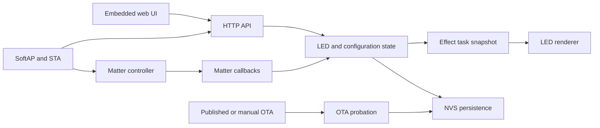

# Architecture

## Current runtime

The firmware is currently implemented in `main/app_main.cpp`. It combines the
embedded web UI, LED renderer, Wi-Fi/captive DNS services, Matter callbacks,
NVS persistence, and OTA lifecycle.



## State ownership

- `s_state_mutex` protects the main LED/configuration state and update status.
- `s_led_mutex` serializes access to the physical LED strip.
- `s_ota_mutex` prevents simultaneous OTA operations.
- Matter callbacks update the canonical LED state and persist Matter color
  trackers (`matter_x`, `matter_y`, and `matter_temp`).
- The effect task is the only runtime renderer. It renders from a copied state
  snapshot, wakes on state changes, and does not hold `s_state_mutex` while
  touching the LED strip.
- The effect task also owns a private "displayed" state (`s_disp_*`) that eases
  brightness and per-channel color toward the target snapshot each frame
  (exponential ease, `kEaseTauMs`; snaps within `kEaseEpsilon`). Only the effect
  task touches these fields — the eased values are display-only and never feed
  back into the canonical state or Matter. Power is derived from the eased
  brightness so on/off fades run to true black.
- Final output is gamma-corrected through `s_gamma_lut`, a 256-entry LUT built
  once at boot by `init_gamma_lut()` (exponent `kGammaExponent`) before the
  effect task starts. Gamma is applied last, per channel, folding effect
  modulation and the eased brightness/color into a single pass.
- The task's notify wait is transition-aware: it keeps rendering at ~40 ms while
  the effect animates OR while an ease is still in flight, and blocks
  indefinitely (`portMAX_DELAY`) only once both settled and non-animated. Any
  control/Matter/schedule change calls `notify_effect_task()` to wake it.

## Update flows

### Web control

1. The browser submits `/api/control`.
2. The request is validated and clamped.
3. State is persisted to NVS and the effect task is notified.
4. Matter attributes are synchronized asynchronously.

### Matter control

1. Matter invokes the attribute callback.
2. The callback converts Matter color values into the canonical RGB state.
3. The LED state is persisted and the effect task is notified.
4. Web clients see the result on their next state request.

### Published OTA

1. The device downloads and verifies the signed manifest.
2. The firmware image is downloaded to the inactive OTA partition.
3. Image size and SHA-256 are checked.
4. An OTA probation marker is written.
5. The device reboots and waits for Wi-Fi plus Matter readiness.
6. The marker is cleared on success; repeated failures roll back.

### Manual OTA

Manual uploads use the same probation lifecycle but intentionally do not use
the signed release-manifest trust chain. This path is for development and
recovery only.

## Network boundaries

- The SoftAP is the setup and administration boundary.
- LAN clients may inspect status and control LEDs.
- Configuration, OTA, reboot, revert, and factory reset require a SoftAP
  client.
- Matter onboarding codes are returned only to SoftAP clients while the Matter
  commissioning window is open.

The current SoftAP boundary is a network-location check, not a replacement for
authenticated HTTPS sessions. A future production hardening pass should add
authenticated sessions and TLS.

## Target module layout

The long-term target is to split the current translation unit into:

```text
main/
  app_main.cpp
  led_engine.cpp/.h
  matter_controller.cpp/.h
  network_manager.cpp/.h
  web_server.cpp/.h
  ota_manager.cpp/.h
  storage.cpp/.h
  web/
    index.html
    app.js
    styles.css
```

Each module should expose events or snapshots rather than directly modifying
another module's globals. The LED driver should have one owning task, and NVS
writes should be queued/debounced rather than performed inside Matter update
callbacks.

## Required verification

- Build with the pinned ESP-IDF and esp-matter revisions.
- Test manual and published OTA with power interruption.
- Test rollback after repeated self-test failure.
- Commission with Apple Home over BLE and after fabric removal.
- Verify LAN clients cannot perform administration actions.
- Verify changing LED count clears pixels outside the new count.
- Verify RGB, HS, XY, and color-temperature changes survive reboot.
